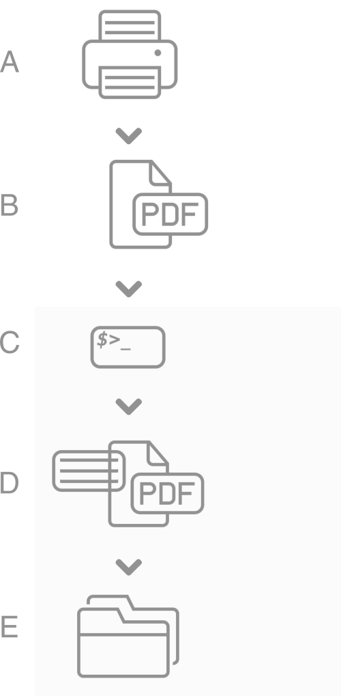

# pdfmd
Pdf metadata managing script.

I use the script `pdfmd.rb`/pdfmetadata (with a slightly different name) to manage my PDF documents and keep the naming in line.  
Hidden deep in the directory structure of my disks I can quickly find the
documents I need with a quick `find /document/path -type f -iname
'*<keyword>*'` which matches some string in the filename.

## Workflow
 My workflow is as follow:   
A) Scan the document. I use a small script for this to scan in color, black-white or grayscale. Generally all scans are black-white/300dpi. Documents with  handwriting on them end up in grayscale and rarely i use color scans.  
  Documents end up as two-sided if there's a two sided print on it, otherwise not.
B) The scanned document is saved as pdf document, no caring about the naming.
C) That is where `pdfmd` comes in. Using `pdfmd` metadata is asked from me to provide. While going through the interactive menu, the document is opened, so it's easier for me to see which document I am working on.
D) The pdf document is updated with the metadata and automatically renamed according to a general naming scheme. That way the document gets uniq and is easy to find on the filesystem level.
E) The document gets automatically sorted away into a folder structure somewhere else on the system.

# Requirements

Although the requirements are listed in the script itself as well (header documentation!), here they are again:

## Ruby Gems

1. [thor](https://rubygems.org/gems/thor)
2. [highline/import](https://rubygems.org/gems/highline)
3. [fileutils](https://rubygems.org/gems/fileutils)
4. [i18n](https://rubygems.org/gems/i18n)
5. [logger]()
6. [pathname]()

Install the requirements as usual

```
$ gem install thor
$ gem install highline
$ gem install fileutils
$ gem install i18n
$ gem install pathname
$ gem install logger
```

## Platforms
### Fedora 21/CentOS 7
* Install the depencies (required to install the rmagick gem)

```
$ sudo yum install -y rubygems rubygems-devel gcc ImageMagick ruby-devel ImageMagick-devel
```

* Install Gem

``` 
$ gem install pdfmd
```

### Ubuntu 14.04 LTS

* Install the dependencies

```
$ sudo apt-get install -y rubygems-integration imagemagick libmagickwand-dev ruby-dev
``` 

* Install gem

``` 
$ sudo gem install pdfmd
``` 


## Applications

1. [exiftools](http://www.sno.phy.queensu.ca/~phil/exiftool/)

This is usually already in your os repositories

```
$ sudo yum install Perl-Image-Exiftool
```

2. [hiera](https://rubygems.org/gems/hiera) can be optionally used to configure
some default settings (instead of a configuration file).

```
$ gem install hiera
``` 

# Usage

The usage is quite simple:

```
$ ./pdfmd.rb [show|edit|rename|sort] [options] <filename>
```

The interface has been setup using Thor.  
So in order to get more information just run the required _help_ command:

``` 
$ pdfmd               # General information
$ pdfmd help <action> # Command specific help
```

My usual workflow is like this:

``` 
$ cd /my/pdf/directory            # Step 1
$ pdfmd show test.pdf             # Step 2
$ pdfmd edit -t all -r test.pdf   # Step 3
$ pdfmd sort .                    # Step 4
``` 

* _Step 1_: Change into the directory with the mess of pdf documents. Here all the files from the scanning before end up.
* _Step 2_: A quick look at the currently set metadata does not hurt. If I find the metadata already in order, I skip this document.
* _Step 3_: For each document I update the PDF metadata to the settings I prefer. The command `pdfmd explain <topic>` explains what the value are used for. Some parameters like _-r_ are actually ommited on my systems, because they have been set by Hiera.
* _Step 4_: In the end I sort all documents according to their metadata into correct subdirectories. The parameter _-d_ is being set from Hiera and makes sure the files end up where they are supposed to be.


There's an underlying logic in the renaming and sorting of the files according to the metadata. Make sure you read at least the help-information before you use it or it might be confusing.

It's also usefull to define some default settings in Hiera to avoid unnecessary typing.

__HINT__: Before you start using the script, make sure you have a backup of your files or you know what you're doing. If you loose information/files I will not be able to help you.


## Password protected files

_pdfmd_ recognises if a pdf file is password protected and will ask for the password.  
A password string can be defined in hiera that will be used per default.

# Bash completion

Pdfmd comes with bash completion. To setup bash completion run the command

$ pdfmd init bash_completion

This will install a bash completion file. A restart of/new console might be necessary to enable it.

# Hiera
 
In order for Hiera to provide (default) configuration data, setup a configuration hash e.g. inside the YAML backend:

``` YAML
pdfmd::config:
  default:
    password    : xxxxxxxxxx
  sort:
    destination : /data/tmp
    copy        : true
    interactive : false
  rename:
    #allkeywords : true # Does not make sense in combination with _keywords_
    keywords    : 2
    outputdir   : /data/output/sorted
    copy        : true
  edit:
    rename      : true

```

Information about which hiera configuration settings are available can be either found in `pdfmd help <command>` or `pdfmd explain hiera`.

Test your hiera configuration with

``` bash
$ hiera pdfmd::config
``` 

# Errors

## Cc1plus: Execvp:

On Debian systems occasionally this wild error appears when sorting:

``` 
gcc: error trying to exec 'cc1plus': execvp: No such file or directory
error: command 'gcc' failed with exit status 1
``` 

**Solution:** Check if the package *g++* is installed:

``` 
$ sudo aptitude install g++
``` 

# Example

This example renames the a document `example.pdf` after fetching the metadata
required to build up the uniq filename.  
The renaming option is set in *hiera* and automatically applied.

``` 
$ pdfmd edit -t all example.pdf 
Changing Createdate, current value: 2015:11:11 06:49:24+01:00
New date value: 20150101120000
Changing Author, current value: 
New value: Daniel Roos
Changing Title, current value: 
New value: Document
Changing Subject, current value: 
New value: Example
Changing Keywords, current value: 
New value: Test file
$ ls *.pdf
20150101-daniel_roos-doc-document_example-test_file.pdf
``` 

# Contact

If you have improvements and suggestions -> let me know.
If you can help me writing tests for this, please let me know as well.

Icons and symbols from [www.opensymbols.org](http://www.opensymbols.org).
