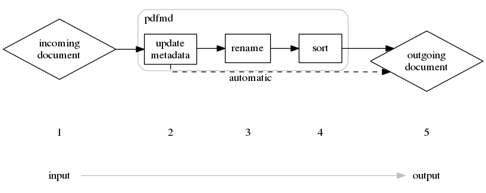

pdfmd/concept

# The requirement

After a couple of years growing into adulthood and dealing with bureaucracy, binders full of paper started growing in my shelfs and I found myself in the middle of question "Should I keep them or throw them?".
I could hardly determine which one to keep, but this process of getting Invoices and official documents and just storing them, did not seem to scale well in the future.

I therefore borrowed a document scanner and digitalized all documents I had.

In the end I found myself with a couple of hundred documents, which I had to store somewhere and somehow.

Out of this the naming scheme for document grew.

    YYYYmmdd-<author>-<document_type>-<title>-<subject>-<keywords>.pdf

This served me well for storing the documents, but became quite tedeous to perform manually with all documents.

# The idea

After a couple of years following this naming procedure, I finally had enough to manually rename the documents, making mistakes in the spelling and have to sort them as well.

Out of necessasity I wrote *pdfmd* which helps me gathering some metadata about a document, putting it into the document, renaming it according to the naming scheme and sorting it away as well.

This significanly brought down the time I spent working on a document from a couple of minutes to less than a minute including scanning the original.

Some error-catching logic implemented also prevents me from making small spelling errors or not following the scheme.

# Workflow

The workflow is fairly simple

1. A document comes in in any way. This can be scanned documents or e-mailattachments, e.g.
2. *Pdfmd* interactively updates the metadata of the document to make sure it correctly reflects the content of the document.
3. *Pdfmd* either automatically or manually renames a single or multiple  document(s) to a consistent naming-sheme.
4. *Pdfmd* sorts either automatically or manually single or multiple documents into a folder structure.
5. The documents coming out of this workflow are stored in a hierarchically folderstructure and easy to find again.

While the incoming document might be called like this:

    $ ls *.pdf
    Scan01.pdf

the finished document after entering some metadata looks like this:

    $ ls *.pdf
    19700101-ibm-inv33265-x3350_server-project_secret.pdf

Just by looking at the filename I can search for

* the date
* the document author
* for an invoice (*inv*)
* for an invoice number (*33265*)
* for a server name (*x3350*)
* for a designated assigned project (*project secret*)

While the metadata can contain even more detailed information, this usually is enough to cover my needs.
