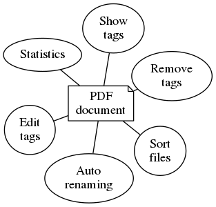

# Welcome to the pdfmd documentation

For the tool visit [pdfmd@rubygems.org](https://rubygems.org/gems/pdfmd "pdfmd").

## Commands

* `pdfmd clean [filename]` - Remove the metadata from a file.
* `pdfmd config`
* `pdfmd edit [filename]` - Edit the metadata of a file.
* `pdfmd help` - Show the help.
* `pdfmd init` - Setup environment (optional)
* `pdfmd rename [filename]` - Rename a file according to its metadata.
* `pdfmd show [filename]` - Show the metadata of a file.
* `pdfmd sort [filename]` - Sort the file to a destination.
* `pdfmd stat [directory]` - Show statistical data about files.


## Features



*Pdfmd* can rename and sort away tagged documents automatically and make sure all files have a consistent name.  

Files can be

* sorted
* tagged
* renamed
* viewed
* cleaned
* included in statistics


## Installation

### pdfmd
Install *pdfmd* as a ruby gem:

```
$ gem install pdfmd
```

### hiera
The use of *hiera* is optional, but makes repeating tasks a lot easier.

Install *hiera* as a ruby gem:

``` 
$ gem install hiera
```

## Sources

* [Github](https://github.com/micronarrativ.org/ruby-pdfmd "Github")
